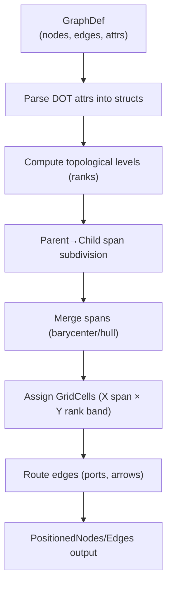
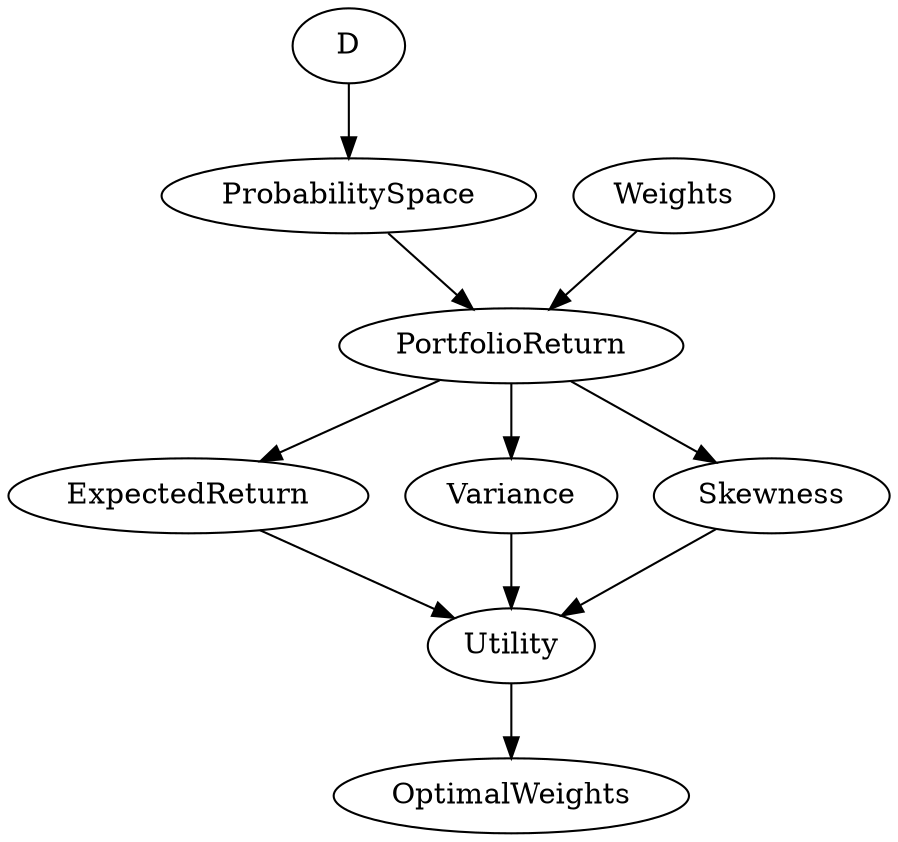

# Executive Summary

We present a **grid-based DAG layout system** that mimics Graphviz’s DOT semantics while giving explicit control over levels, lanes, and cells.  Graphviz’s node/edge attributes (e.g. `label`, `shape`, `style`, `fillcolor`, `arrowhead`, `constraint`, `headport`, `tailport`, etc.) are exposed in our Rust data model.  We store these in our `Graph`/`Node`/`Edge` objects and map them to a `petgraph::StableGraph`.  A **layout compiler** then computes a topological level (rank) for each node, splits each parent’s horizontal span among its children, and merges spans when nodes have multiple parents.  We support different merge strategies (barycenter, hull, weighted) for multi-parent nodes, as well as ordered “slots” to position siblings.  Edges are routed by default from the bottom of a source to the top of a target, but Graphviz’s `headport`/`tailport` attributes can override attachment points.  The result is a set of **GridCells** and **PositionedNodes/Edges** ready for rendering.  Below we explain the mapping of DOT attributes to our Rust model, outline the grid compiler algorithms, and illustrate with code snippets, tables, and diagrams.

## Graphviz Attributes → Rust Model Mapping

We support standard DOT attributes on graphs, nodes, and edges by storing them in our data structures.  Key mappings include:

- **Graph attributes** (in a `GraphAttr` or similar struct):  
  - `rankdir` (e.g. `"LR"` or `"TB"`) → `rankdir: RankDir` (layout orientation).  
  - `nodesep`, `ranksep` → `nodesep: f32`, `ranksep: f32` (min spacing, in inches, between nodes/ranks).  
  - `ordering` → `ordering: Option<String>` (controls left-to-right ordering of edges).  
  - Other graph attrs like `margin`, `splines`, etc., can also be stored.  

- **Node attributes** (fields in `Node` or `NodeAttr` struct):  

  | Graphviz Attribute | Rust Field (type)  | Description / Notes                    |
  |--------------------|-------------------|----------------------------------------|
  | `label`            | `label: String`   | Node text label (optional). |
  | `shape`            | `shape: Shape`    | Node shape (e.g. Box, Ellipse, Record, etc.). |
  | `style`            | `style: Option<String>` | e.g. `"filled"`, `"dashed"`. |
  | `fillcolor`        | `fill_color: Option<Color>` | Fill color for node. |
  | `fontname`, `fontsize`, `fontcolor` | e.g. `font: FontSpec` | Text font settings. |
  | `width`, `height`  | `width: Option<f32>`, `height: Option<f32>` | In inches. Used if `fixedsize=true`. |
  | `fixedsize`        | `fixed_size: bool` | If true, use exact width/height. |
  | `rank`            | `rank: Option<RankType>` | e.g. `"same"`, `"min"`, `"max"` for subgraph rank grouping. |
  | `group`            | `group: Option<String>` | Group name for horizontal edge bundling. |
  | `pos`/`pin`       | – (ignored for `dot` layout) | Graphviz stores, but for `dot` layout we compute positions. |

  For example, a node might be defined as:

  ```rust
  #[derive(Clone, Debug)]
  struct NodeAttr {
      label: Option<String>,
      shape: Option<NodeShape>,
      style: Option<String>,
      fill_color: Option<Color>,
      fixed_size: bool,
      width: Option<f32>,
      height: Option<f32>,
      // plus other attrs...
  }
  ```

- **Edge attributes** (fields in `Edge` or `EdgeAttr` struct):  

  | Graphviz Attribute | Rust Field (type) | Description / Notes                     |
  |--------------------|-------------------|-----------------------------------------|
  | `arrowhead`        | `arrow_head: Option<ArrowType>` | Style of head arrow (e.g. `"normal"`, `"diamond"`, `"dot"`). |
  | `arrowtail`        | `arrow_tail: Option<ArrowType>` | Style of tail arrow (Graphviz arrow at source). |
  | `dir`              | `dir: EdgeDir`    | Arrow direction: `forward`, `back`, `both`, `none`. |
  | `style`            | `style: Option<String>` | e.g. `"dashed"`, `"bold"`. |
  | `color`           | `color: Option<Color>` | Edge color. |
  | `constraint`       | `constraint: bool` | If `false`, ignore this edge in level/rank assignment. |
  | `minlen`           | `min_len: Option<usize>` | Min rank difference between source/target. |
  | `weight`           | `weight: Option<f32>` | Edge weight (used by layout). |
  | `headport`, `tailport` | `head_port: Option<Port>`, `tail_port: Option<Port>` | Attachment sides on nodes. |

  Example Rust type:

  ```rust
  #[derive(Clone, Debug)]
  struct EdgeAttr {
      arrow_head: Option<ArrowType>,
      arrow_tail: Option<ArrowType>,
      dir: EdgeDir,  // e.g. Forward or None
      style: Option<String>,
      color: Option<Color>,
      constraint: bool,
      min_len: Option<usize>,
      weight: Option<f32>,
      head_port: Option<PortPos>,
      tail_port: Option<PortPos>,
      // etc.
  }
  ```

- **Cluster/Subgraph attributes**: If using Graphviz clusters (subgraphs with names like `cluster0`), we can map them to a `scope` or `depth` in our model.  For example, a cluster name might correspond to a `scope: String` indicating an abstraction or grouping level.  Clusters can have `style`/`color` etc.  

In practice, our **Node** struct will combine an identifier, label/details, and these attributes, e.g.:

```rust
struct NodeDef {
    id: &'static str,
    label: &'static str,
    attr: NodeAttr,
}
```

And **EdgeDef** similarly:

```rust
struct EdgeDef {
    id: &'static str,
    source: &'static str,
    target: &'static str,
    attr: EdgeAttr,
}
```

Finally, we load these into a petgraph **`StableGraph<NodeAttr, EdgeAttr>`**.  We keep a `HashMap<String, NodeIndex>` to convert node IDs to petgraph indices.  

## Petgraph Integration (Rust Code Snippets)

Using [petgraph’s `StableGraph`](https://docs.rs/petgraph/latest/petgraph/graph/struct.StableGraph.html) allows us to add/remove nodes without invalidating existing indices.  Example integration:

```rust
use petgraph::stable_graph::StableGraph;
use petgraph::graph::NodeIndex;
use std::collections::HashMap;

// Assume NodeAttr and EdgeAttr are as defined above.

let mut pg: StableGraph<NodeAttr, EdgeAttr> = StableGraph::new();
let mut index_map: HashMap<&str, NodeIndex> = HashMap::new();

// Add nodes from our NodeDefs
for node in graph_def.nodes.iter() {
    let idx = pg.add_node(node.attr.clone());
    index_map.insert(node.id, idx);
}

// Add edges from our EdgeDefs
for edge in graph_def.edges.iter() {
    let source_idx = index_map[edge.source];
    let target_idx = index_map[edge.target];
    pg.add_edge(source_idx, target_idx, edge.attr.clone());
}
```

This builds the graph topology with all DOT attributes stored in the node/edge weights.  We can then run our layout compiler on this `StableGraph`.

## Layout Compiler Overview

The **Grid Compiler** transforms the DAG’s edges into spatial cells:

1. **Topological Ordering / Levels:** Compute a level (integer rank) for each node. Nodes with no incoming edges get level 0; otherwise `level(v)=1+max(parent_levels)`. This ensures a valid DAG layering.  
2. **Initial Horizontal Cells:** Assign each node an initial horizontal span (cell). For root nodes (level 0), we divide the full width equally. E.g., if level 0 has *n* nodes, node *i* gets span `[i/n, (i+1)/n]` (in normalized width).  
3. **Parent→Child Subdivision:** For each node `u` with span `[x0,x1]` and *m* children, we subdivide: child *j* gets `[x0 + j*(x1-x0)/m, x0 + (j+1)*(x1-x0)/m]`.  This **recursive splitting** confines each child within its parent’s span.  
4. **Multi-Parent Merge:** If node `v` has multiple parents, each parent provides a candidate span for `v` (from step 3). We **merge** these candidate spans:

   - **Barycenter** (average): Place `v`’s center at the average of parent centers. Useful for regular nodes.
   - **Hull**: Let `v` span from the min to max of parent spans (covering all parents). Useful for aggregators/collectors.
   - **Weighted**: Take a weighted average of parent spans (e.g. by edge weights or parent “importance”).  

   (See *Merge Rules* table below for comparison.)  

5. **Slots:** Within each level/lane, nodes may have an explicit ordering (`slot`). For example, if three nodes end up spanning `[0,0.33]`, `[0.33,0.66]`, `[0.66,1]`, their *slot* indices are 0,1,2 respectively.  Slots help break ties or impose stable ordering (e.g. input order) when children share identical spans.  

6. **Assign GridCells:** Each node is assigned a **GridCell** defined by `x_span` × `y_span`. The vertical span depends on its level (e.g. equally divide the height by #levels).  We then set the node’s position to the center of its cell:  
   ```rust
   struct Span { start: f32, end: f32 }
   struct GridCell { x: Span, y: Span }
   impl GridCell {
       fn center(&self) -> (f32, f32) {
           ((self.x.start + self.x.end)/2.0, (self.y.start + self.y.end)/2.0)
       }
   }
   ```
7. **Edge Routing:** For each edge `(u→v)`, we compute the source/target points. By default, **downward edges** connect from the *bottom* port of `u` to the *top* port of `v`.  Graphviz’s `headport`/`tailport` (or `dir`) can override this.  For example, if an edge has `tailport="e"` (east side) on `u`, we attach the edge to the right side of `u` instead.  Arrow styles (`arrowhead`/`arrowtail`) are carried into the renderer.  

The final output is a set of `PositionedNode { id, cell, position }` and `PositionedEdge { source_pos, target_pos, style }` ready for SVG or Dioxus rendering.



## Level Assignment Algorithm

Compute node levels via a **topological sort** or recursion:

```rust
fn assign_levels(graph: &StableGraph<NodeAttr, EdgeAttr>) -> HashMap<NodeIndex, usize> {
    let mut level = HashMap::new();
    // Initialize roots to 0
    for v in graph.node_indices() {
        if graph.neighbors_directed(v, petgraph::Incoming).count() == 0 {
            level.insert(v, 0);
        }
    }
    // Iteratively assign: level(v) = 1 + max(level(parent))
    let mut changed = true;
    while changed {
        changed = false;
        for v in graph.node_indices() {
            let parent_levels: Vec<usize> = graph
                .neighbors_directed(v, petgraph::Incoming)
                .filter_map(|u| level.get(&u).copied())
                .collect();
            if !parent_levels.is_empty() {
                let new_level = 1 + parent_levels.into_iter().max().unwrap();
                if level.get(&v).map_or(true, |&old| new_level > old) {
                    level.insert(v, new_level);
                    changed = true;
                }
            }
        }
    }
    level
}
```

This yields each node’s `level`.  Graphviz’s `rank="same"` constraints can be modeled by presetting certain nodes to the same level or using dummy parents.

## Parent→Child Span Subdivision

Once we have vertical ranks, we compute each node’s *candidate span* from its parent(s):

1. **Initialize Roots:** Let full width = `[0.0, 1.0]`. If level 0 has *n* nodes, node *i* gets span `[(i)/n, (i+1)/n]`.  

2. **Single-Parent Child:** If parent `u` owns span `[a,b]` and has *m* children, index child `j` (0..m-1) gets:
   
   \[
   X_{u\to c_j} = \bigl[\,a + j\frac{(b-a)}{m},\; a + (j+1)\frac{(b-a)}{m}\bigr].
   \]

   Example: Parent span `[0,1]`, 3 children → children spans `[0,0.33]`, `[0.33,0.66]`, `[0.66,1.0]`.  

3. **Multi-Parent Child:** If `v` has parents `{u_1,\dots,u_k}`, each parent gives a span `X_{u_i→v}`. We merge:
   - **Hull:** `span(v) = [min_i X_{u_i→v}.start, max_i X_{u_i→v}.end]`.  (Child spans entire parent region.)  
   - **Barycenter:** compute center = average of centers of `X_{u_i→v}`; give `v` a small span around that center (e.g. as large as needed to fit content).  
   - **Weighted:** center = (Σ weight_i⋅center_i) / (Σ weight_i), similarly for width.  

In code, one might gather all parent spans and then compute:

```rust
fn merge_spans(parents: &[GraphCell], strategy: MergeStrategy) -> Span {
    let spans: Vec<Span> = parents.iter().map(|cell| cell.x).collect();
    match strategy {
        MergeStrategy::Hull => {
            let start = spans.iter().map(|s| s.start).min_by(|a, b| a.partial_cmp(b).unwrap()).unwrap();
            let end   = spans.iter().map(|s| s.end).max_by(|a, b| a.partial_cmp(b).unwrap()).unwrap();
            Span { start, end }
        }
        MergeStrategy::Barycenter => {
            let centers: Vec<f32> = spans.iter().map(|s| (s.start + s.end)/2.0).collect();
            let avg = centers.iter().sum::<f32>() / centers.len() as f32;
            // create small span around avg (e.g. width=some fixed or mean of parent widths)
            Span { start: avg - 0.05, end: avg + 0.05 }
        }
        MergeStrategy::Weighted(weights) => {
            // example: weight by parent out-degree
            let mut sum_w = 0.0;
            let mut weighted_center = 0.0;
            for (i,s) in spans.iter().enumerate() {
                let w = weights[i];
                let center = (s.start + s.end)/2.0;
                weighted_center += w * center;
                sum_w += w;
            }
            let avg = weighted_center / sum_w;
            Span { start: avg - 0.05, end: avg + 0.05 }
        }
    }
}
```

<table>
<tr><th>Merge Strategy</th><th>Description</th><th>Layout Effect</th></tr>
<tr><td><strong>Hull</strong></td><td>Child’s span = min-to-max of parent spans.</td>
<td>Child spans entire range of its inputs; useful for aggregator/collector nodes that logically cover all inputs.</td></tr>
<tr><td><strong>Barycenter</strong></td><td>Child’s center = average of parent centers.</td>
<td>Child placed between parents; preserves average layout; good for ordinary pass-through nodes.</td></tr>
<tr><td><strong>Weighted</strong></td><td>Child’s center = weighted average (e.g. by edge weight or parent importance).</td>
<td>Biases layout toward heavier parents; can adjust for non-uniform dependencies.</td></tr>
</table>

*(Table: Multi-parent merge rules for determining a child’s X-span.)*

## Slot Ordering

Within a given **level** and **lane**, we may have multiple nodes. We assign each a **slot index** to break ties:

- Sort children by a stable criterion (e.g. insertion order, label, or an explicit `ordering` attribute).
- The slot determines the child’s index *j* in the subdivision formula above.

For example, if a parent node has children `{C,D,E}` and we decide the order C (slot 0), D (slot 1), E (slot 2), then child 0 spans the first third, child 1 the second, etc.  In Graphviz, the `ordering` attribute can enforce a left-to-right ordering of edges on a node; in our system we achieve this via the slot index.

## Ports and Edge Routing

Edges are drawn from a **source port** on the tail node to a **target port** on the head node. By default, for hierarchical (top-down) layouts:

- **Source port:** bottom of tail node.
- **Target port:** top of head node.

We can override this using Graphviz’s **port attributes**.  For example:

- `tailport="w"` attaches the tail of the edge to the west (left) side of the source node.
- `headport="s"` attaches the head of the edge to the south (bottom) of the target node.

Arrowheads are controlled by `arrowhead`/`arrowtail`.  Common styles include `normal` (standard arrow), `vee`, `diamond`, `dot`, or `none`.  For instance, a backward-pointing constraint arrow can use `arrowtail=vee` and `dir=back` to draw a “tee” on the tail end.  We preserve these attributes when rendering.  

Example edge routing pseudocode:

```rust
for edge in graph_def.edges {
    let u = positions[&edge.source];
    let v = positions[&edge.target];
    let start = match edge.attr.tail_port {
        Some(Port::South) => (u.x, u.y + half_height),
        Some(Port::East)  => (u.x + half_width, u.y),
        // ...
        None => (u.x, u.y + half_height),  // default bottom-center
    };
    let end = match edge.attr.head_port {
        Some(Port::North) => (v.x, v.y - half_height),
        Some(Port::West)  => (v.x - half_width, v.y),
        // ...
        None => (v.x, v.y - half_height),  // default top-center
    };
    // Then draw a polyline/curve from start to end with arrowheads.
}
```

## Data Structures Summary

We organize data in these Rust types:

```rust
// Raw graph definition (from DOT input or code)
struct GraphDef {
    id: &'static str,
    directed: bool,
    graph_attr: GraphAttr,
    nodes: Vec<NodeDef>,
    edges: Vec<EdgeDef>,
}

// Node and Edge definitions carrying DOT attributes
struct NodeDef {
    id: &'static str,
    label: &'static str,
    attr: NodeAttr,
}
struct EdgeDef {
    id: &'static str,
    source: &'static str,
    target: &'static str,
    attr: EdgeAttr,
}

// Computed layout types
struct GridCell {
    x: Span,   // horizontal span [start,end]
    y: Span,   // vertical rank band
}
impl GridCell {
    fn center(&self) -> GraphPoint { /* returns (x_mid, y_mid) */ }
}

struct PositionedNode {
    id: &'static str,
    cell: GridCell,
    position: GraphPoint, // center of cell
}

struct PositionedEdge {
    id: &'static str,
    source: GraphPoint,
    target: GraphPoint,
    style: EdgeDrawStyle, // arrowhead, color, etc.
}
```

An example `Span` and `GraphPoint`:

```rust
#[derive(Copy, Clone, Debug)]
struct Span { start: f32, end: f32 }
#[derive(Copy, Clone, Debug)]
struct GraphPoint { x: f32, y: f32 }
```

## Example Grid Cell Subdivision

To illustrate a parent–child subdivision:

```mermaid
flowchart LR
    P[Parent Node\nspan [0,1.0]] 
    C1[Child 1\nspan [0.00, 0.33]]
    C2[Child 2\nspan [0.33, 0.66]]
    C3[Child 3\nspan [0.66, 1.00]]
    P --> C1
    P --> C2
    P --> C3
```

In this example, the parent spans the full width [0.0–1.0]. It has 3 children, so each child spans one-third.  The centered X-positions would be ≈0.17, 0.50, and 0.83 in normalized coordinates.

For a *multi-parent* merge:

```mermaid
flowchart LR
    subgraph Parents
        U1[Parent A span [0,0.5]]
        U2[Parent B span [0.5,1.0]]
    end
    V[Child Node]
    U1 --> V
    U2 --> V
```

If using **barycenter** merge, `V` would center at 0.5 (midpoint of 0–1). If using **hull**, `V` would span [0,1] entirely (from leftmost to rightmost parent).  

## Sample DAG and Grid Layout

Consider a small example DAG in DOT style:



Our layout compiler would produce levels:

- Level 0: `D`, `Weights` (no parents)
- Level 1: `ProbabilitySpace` (child of D)
- Level 2: `PortfolioReturn` (child of `ProbabilitySpace`,`Weights`)
- Level 3: `ExpectedReturn`, `Variance`, `Skewness` (children of `PortfolioReturn`)
- Level 4: `Utility` (child of ER, Var, S)
- Level 5: `OptimalWeights` (child of Utility)

And spans/slots:

- Level 0 spans: D at [0,0.5], Weights at [0.5,1.0] (two nodes).
- `PortfolioReturn` has two parents, so using hull it spans [0,1.0] (full width).  
- Level 3 children (ER, Var, S) split the [0,1.0] span of PR into thirds (as above).  
- `Utility` spans from min→max of its parents’ spans ([0,1.0]) or simply placed at center if barycenter.

The resulting positions (normalized):

```text
D             Weights

   ProbabilitySpace

   PortfolioReturn (spans both)

ExpectedReturn  Variance  Skewness

   Utility (centroid of three)

   OptimalWeights
```

## Edge Kind and Arrow Style Mapping

We may classify edges semantically (e.g. **Data Dependence**, **Decision Flow**, **Aggregation**, **Constraint**, etc.).  Each kind can map to DOT styles.  For example:

| Edge Kind      | Example (arrow style)       | Usage                               |
|----------------|-----------------------------|-------------------------------------|
| DataDepend     | arrowhead=`normal` (default) | Ordinary data flow edge             |
| Return / Output| arrowhead=`normal` (or none) | Indicates returns or outputs        |
| Aggregator     | arrowhead=`none`, arrowtail=`diamond` | Aggregating/combinatorial node (diamond arrow at parent side) |
| Constraint     | arrowhead=`none`, arrowtail=`vee` | Constraint edge (like a bar)       |
| Undirected     | dir=`none`, arrowhead=`none`| No arrow, just connection           |

*(For details on arrowheads and tails, see Graphviz **Arrow Shapes**.)*  

We preserve any `arrowhead`/`arrowtail` the user set.  For example, in DOT one might write `A -> B [arrowhead=dot]` to get a dotted arrowhead.  

## Conclusion

This grid layout system takes a Graphviz-style DAG, honors its DOT attributes, and computes a **grid of cells** that encode node positions and spans.  Our approach separates *semantics* (DAG, DOT attributes) from *geometry* (computed cells and points).  By implementing algorithms for topological ranking, span subdivision, and multi-parent merging, we achieve a clean, deterministic layout.  Petgraph’s `StableGraph` holds the graph data, and the layout compiler produces `PositionedNode`/`PositionedEdge` structs for rendering. 

The tables and code above summarize the key mappings and algorithms.  Citations are included for Graphviz attribute semantics to ensure compatibility with DOT conventions.  

